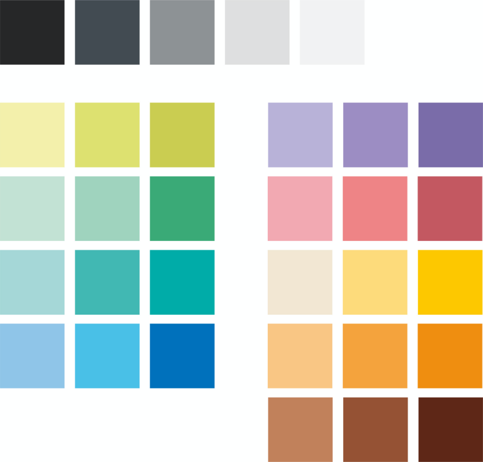
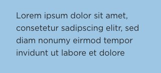
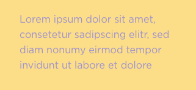
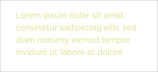

## Primary

<Grid columns={2} gap={4}>
<BrandBox>
<BrandColor 
    colorName = "Black"
    colorHex = "#272727"
    colorRGB = "39, 39, 39"
    colorCMYK = "0, 0, 0, 98"
/>
<BrandCaption>Black black doesn’t really exist (SEE: Vantablack, Black 3.0). 
Moreover, hard blacks can ‘hurt’ on screen, whereas grey blacks look faded in print. Black is actually a pretty hard colour. 
EIL has a different black for print and digital. Pure black is never used.  
The print black is not a rich black, but should always be used with overprint on. 
</BrandCaption>
</BrandBox>
<BrandBox>
<BrandColor 
    colorName = "White"
    colorHex = "#FFFFFF"
    colorRGB = "255, 255, 255"
    colorCMYK = "0, 0, 0, 98"
/>
<BrandCaption>Our white is, just, well, white. 
</BrandCaption>
</BrandBox>
</Grid>

 

<Grid columns={3} gap={4}>
    <BrandColor 
        colorName = "Lime"
        colorHex = "#E1E47F"
        colorRGB = "225, 228, 127"
        colorCMYK = "17, 0, 62, 0"
    />
    <BrandColor 
        colorName = "Salmon"
        colorHex = "#F48D88"
        colorRGB = "244, 141, 136"
        colorCMYK = "0, 55, 40, 98"
    />
    <BrandColor 
        colorName = "Sand"
        colorHex = "#FCDD88"
        colorRGB = "252, 221, 136"
        colorCMYK = "0, 15, 55, 0"
    />
    <BrandColor 
        colorName = "Sky"
        colorHex = "#9DC6E5"
        colorRGB = "157, 198, 229"
        colorCMYK = "42, 10, 0, 0"
    />
    <BrandColor 
        colorName = "Teal"
        colorHex = "#ABDBC6"
        colorRGB = "171, 219, 198"
        colorCMYK = "40, 0, 30, 0"
    />
    <BrandColor 
        colorName = "Violet"
        colorHex = "#9C91D0"
        colorRGB = "156, 145, 208"
        colorCMYK = "45, 43, 0, 0"
    />
</Grid>

 

**Campuses** Each of the campuses is associated with a primary colour — this is used in campus specific communication or branding. For example, social media profiles, video borders, city platforms or campus signage. Countries use the colour of the campus capital.

---

## Secondary

Beyond the 6 primaries, the aesthetic of Ecole Intuit Lab calls for many colours. The choice of colour is fairly flexible based on the creative in question.
Here is a selection of lights (for highlights), base (colour), and darks that can be used together to create coherent communication.

---

## Combinations

You are free to combine colours as you see fit for the most part, but here are some guidelines to prevent unfortunate results:

### Contrast

Especially when using text, be mindful of contrast. Web standards recommend, for AA (minimum) and AAA (high) the following contrasts: (use this tool to check)

|       &nbsp;       |      &nbsp;               | AA           | AAA           |
| :----------------- | ------------------------- |:------------:| :------------:| 
| Normal Text        | 16px + Regular            | 4.5:1        | 7:1           |
| Large Text         | 18.66px + Bold, or 24px + | 3:1          | 4.5:1         |

<Grid columns={2} gap={2}>

    
<BrandRule>The primary colours have been chosen such that EIL Black text always passes contrast checks on them.
</BrandRule>

    
<BrandRule do={false}>Avoid coloured text unless in EIL Sans Bold and adequately large.</BrandRule>

    
<BrandRule do={false}>Avoid using coloured text on coloured backgrounds, even if it passes a contrast check.
</BrandRule>

</Grid>
  

### Pairing

Most creative surfaces are expected to have ONE main colour: other colour accents may be used, but let the creative be memorable for a single colour. That said, if combining colours:

<Grid columns={2} gap={2}>

    
<BrandRule>When placing colours next to each other, create energy in their contrast. ‘Bright’ is the brief.
</BrandRule>

    
<BrandRule do={false}>Do not place similar colours next to each other.
</BrandRule>

    
<BrandRule do={false}>Although this guideline is met with exceptions, avoid in general, having two colour blocks touch each other. They are always separated by white space, or black outlines.
</BrandRule>

    
<BrandRule do={false}>Colours are never used directly atop each other without a white or black delineator.
</BrandRule>

</Grid>
