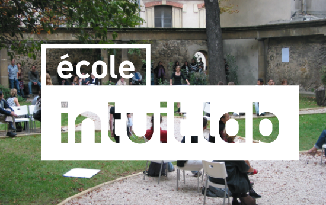
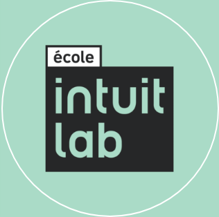
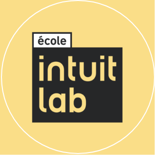
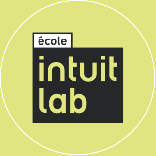
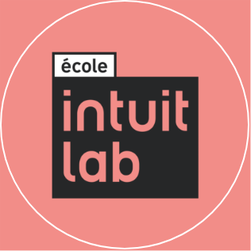

## The Name

To maintain consistency across countries and languages, the name of the school is always written the same way: Title Case, with an accents on the first É. The school name is followed by the country or city of the school in question.

<BrandRule do={true} Background={true}>  
École Intuit Lab
</BrandRule>

<BrandRule do={true} Background={true}> École Intuit Lab Paris</BrandRule>  
<BrandRule do={true} Background={true}>École Intuit Lab India</BrandRule>    

<Grid gap={2} columns={2}>
<BrandRule do={false} > Intuit Lab</BrandRule>   
<BrandBox color='#828282'>Do not drop the Ecole.</BrandBox>
</Grid>

<Grid gap={2} columns={2}>
<BrandRule do={false} > EIL Bombay</BrandRule>   
<BrandBox color='#828282'>Do not abbreviate.</BrandBox>
</Grid>

<Grid gap={2} columns={2}>
<BrandRule do={false} > école intuit lab</BrandRule>   
<BrandBox color='#828282'> Do not use lowercase at the start of a word</BrandBox>
</Grid>

<Grid gap={2} columns={2}>
<BrandRule do={false} > école intuit.lab</BrandRule>   
<BrandBox color='#828282'>Do not use a period between words. </BrandBox>
</Grid>

<Grid gap={2} columns={2}>
<BrandRule do={false} > Ecole</BrandRule>   
<BrandBox color='#828282'> Do not refer to solely as Ecole. </BrandBox>
</Grid>

<Grid gap={2} columns={2}>
<BrandRule do={false}  > Ecole Intuit</BrandRule>   
<BrandBox color='#828282'> Do not drop the lab </BrandBox>
</Grid>

---

## The Logos

The various editions of the logos are to be used based on scenario. The simplest is the solo logo, which is used in most situations.

### Solo

The following guidelines for the 3 versions of every logo unit apply to all logo units.

<Grid columns={3}>

<BrandBox>

**Transparent**
This is to be used on undisturbed, light backgrounds at large scale only.
</BrandBox>

<BrandBox>

**Solid**
Used most frequently, on any range of backgrounds and at any size.
</BrandBox>

<BrandBox>

**Inverted**
For exclusive use as a watermark on photos or videos, after the logo has already been presented.
</BrandBox>

</Grid>

### Square

A special series of square logos exist for social media profiles. They are exclusively for this use, and never to be used on any communication materials.

<Grid columns={4}>

<BrandBox>

</BrandBox>

<BrandBox>

</BrandBox>

<BrandBox>

</BrandBox>

<BrandBox>

</BrandBox>

</Grid>
