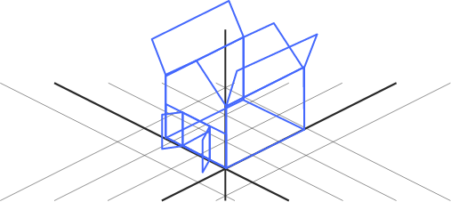
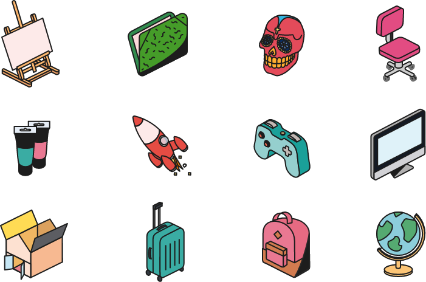
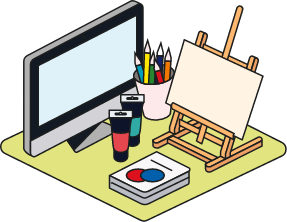

The signature element of the brand, a large part of communication is done through a series of colourful, isometric illustrations with their own simple style. 

## Objects

These are the base individual elements of the illustrative universe. These can be used by themselves or as constructors for the compositions and platforms. 
If you would like to see an object added to the library, contact [brand@ecole-intuit-lab.com](brand@ecole-intuit-lab.com) with your request. 

---

## Compositions

Using the objects, you can create any variety of compositions to communicate an idea. Given how vast the permutations are, we have a growing library of compositions. 
There are no rules, but some suggestions:

<Grid gap={2} columns={3}>
<BrandBox>

</BrandBox>
<BrandBox>

</BrandBox>
<BrandBox>

</BrandBox>
</Grid>

 

<BrandRule> <strong>Inventive & Poetic </strong>

Ecole Intuit Lab is a place for ideas, and the illustrations should reflect that. We don’t represent ‘the cloud’ with a cloud, but with rockets. Get creative, get metaphoric, bring upon a smile!
</BrandRule>
<BrandRule> <strong>Just a few </strong>

Try to keep to a maximum of 3 major elements. Small element additions beyond this can be fun, but further than that, it gets crowded. 
</BrandRule>
<BrandRule> <strong>Play with proportions </strong>

Make a concerted effort to break natural proportions. This is to avoid creating ‘scenes’ but rather ‘messages’. For example, a suitcase is hardly the size of the Eiffel Tower, nor is a Mac quite as large as a chair. 
</BrandRule>
<BrandRule> <strong>Balance Colours </strong>

Avoid all your elements being of the same colour or same colour tone. You are welcome to change colours of objects such as suitcases, books, bags etc. 
</BrandRule>
<BrandRule> <strong>Outlines are thick, and all the same weight  </strong>

Proportion up with scale of usage. 1 composition, 1 outline weight. 
</BrandRule>
<BrandRule> <strong>Concentrated, overlapped </strong>

Objects should gather around a central point, and more than likely overlap. They are not lined up by one another. 
</BrandRule>

---

## Platforms

More complex compositions can be gathered on a signature isometric platform. These are often used to represent an entire program, or as the hero element in communication. 
They are never used on or in combination with photos. 

<Grid gap={2} columns={2}>
<BrandBox>

</BrandBox>
<BrandBox>

</BrandBox>
<BrandBox>

</BrandBox>
<BrandBox>

</BrandBox>
</Grid>

 
All of the tips for compositions apply, with a few additions:

<BrandRule> <strong>Just a few </strong>

Try to keep to a maximum of 5 major elements. Small element additions beyond this can be fun, but further than that, it gets crowded. 
</BrandRule>
<BrandRule do={false}> <strong>Never show the back corner, don’t cover the other corners. </strong>

Make sure that your objects conceal the back corner of the platform, it should never be visible. The other 3 corners should ALWAYS be visible. 
</BrandRule>
<BrandRule> <strong>Pick a theme </strong>

These are not intended to be collections of everything — despite the combination, the platform should convey a clear idea. 
</BrandRule>

---

## Campuses

Each campus is represented by a recognisable city attraction. These illustrations are used strictly when making reference to the Ecole Intuit Lab campus, and not just a taxi/bridge/city etc. Their colours are not modifiable. 

