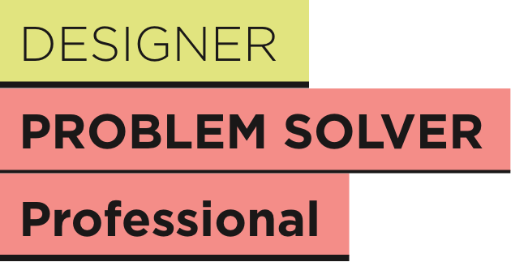

## Fonts

All communication and creatives use only two fonts: EIL Serif and EIL Sans Serif (based off of Gotham).

<Grid gap={2} columns={2}>
  <BrandFont 
    fontName="EIL Sans"
    font="Montserrat"
    />
    <BrandFont 
    fontName="EIL Serif"
    font="Playfair Display"
    />
</Grid>

<Grid gap={2} columns={2}>
  <BrandBox>
    <BrandRule
      noBackground={true}
      font='Montserrat'
      fontSize='24px'
      fontWeight='200'
      >EIL Sans Light</BrandRule>
    <BrandRule
      noBackground={true}
      font='Montserrat'
      fontSize='24px'
      fontWeight='400'
      >EIL Sans Book</BrandRule>
    <BrandRule
      noBackground={true}
      font='Montserrat'
      fontSize='24px'
      fontWeight='600'
      >EIL Sans Bold</BrandRule>
    <BrandRule
      do={false}
      noBackground={true}
      font='Montserrat'
      fontSize='24px'
      fontWeight='800'
      >Gotham</BrandRule>
      
  </BrandBox>

  <BrandBox>
    <BrandRule
      noBackground={true}
      font='Playfair Display'
      fontSize='24px'
      fontWeight='400'
      >EIL Serif</BrandRule>
    <BrandRule
      do={false}
      noBackground={true}
      font='Playfair Display'
      fontSize='24px'
      fontWeight='800'
      >EIL Bold</BrandRule>
      
  </BrandBox>

</Grid>

Most creative work and communication will use EIL Sans. EIL Serif is to be used selectively, in low volume and large scale only. It may be used for level 1 titles, to accentuate names or as decorative type. It is never used in all UPPERCASE.

---

## Styles

The below are a series of suggested styles of typography. They are not exhaustive. Nor should all designs use all these styles at once. Combine a minimum of styles to maximise communication hierarchy.

<BrandBox 
  noBackground={true}
  font='Playfair Display'
  fontSize='60px'
  lineHeight='80px'
   > Top title</BrandBox>   
<BrandCaption extraSpace={true}> This is usually used as a top level title, never more than once in a single creative. Make not of relatively tight tracking and leading on these fonts.</BrandCaption>  

<BrandBox 
  noBackground={true}
  font='Montserrat'
  fontSize='30px'
  lineHeight='40px'
  case='uppercase'
   > Secondary title</BrandBox>  
  <BrandBox 
  noBackground={true}
  font='Montserrat'
  fontSize='25px'
  lineHeight='40px'
  case='uppercase'
   > Tertiary title</BrandBox>

<BrandCaption extraSpace={true}> Always in uppercase. </BrandCaption>

<BrandBox 
  noBackground={true}
  font='Montserrat'
  fontSize='26px'
  fontWeight='200'
  lineHeight='30px'
   > Leading or subtitle text usually running
over two or more lines</BrandBox>  

<BrandCaption extraSpace={true}> This is one of the rare uses of the ‘light’ version of EIL Sans. Used under top level titles, or before main body text in documents and written digital communication. It is intended to contain the main message of the proceeding paragraphs. </BrandCaption>

<Grid columns={[3, '3fr 1fr 3fr']} gap={5}>
  <BrandBox>

 
</BrandBox>

  <BrandBox>

</BrandBox>
</Grid>

<BrandCaption extraSpace={true}> Used in a variety of colours, but always the same style,  height, and black underline; only with EIL Sans Bold. 
This is a style used either for titles or for links (digital) that are ‘invitations’ to discover other pages. 
Make special note of the spacing around the text, which defines the size of the ‘band’. Also note that the ‘underline’ is strictly the thickness of the letter I in EIL Sans Bold at the given size.  </BrandCaption>

Body text **always** uses EIL Sans Book. Do not set body entirely in bold text, although it may be used to highlight content. Also do not set any body text in Light, it is illisible. In terms of text decoration, you may used __underline__, or ~~strikethrough~~. Italics is not used. 

<BrandCaption extraSpace={true}> 
Make note of the proportion between font size and leading: 1:1.5 is the minimum ratio. 
Also note that for large blocks of text (50+ words), we always maintain width to have 10-12 words a line.  
</BrandCaption>

  
<BrandBox 
  noBackground={true}
  color='#E1E47F'
  font='Playfair Display'
  fontSize='100px'
  lineHeight='20px'
   >“”</BrandBox>  

<BrandCaption extraSpace={true}> Note that quote marks are always displayed in EIL Serif, although the quote itself is not.  </BrandCaption>

---

## Compositions

The below are some examples of how composition is used to make titles with the EIL typography. Please make special note of permitted colour use (only bands, not text), of the use of EIL Sans Bold uppercase, selective used of EIL Serif, equidistant spacing around text in bands, and weight of ‘stroke’ or ‘underline’.

<BrandRule noBackground={true}>Here are some examples of banded compositions </BrandRule>

<BrandBox Background='#f5f5f5' extraSpace={true}> 

<Grid columns={2}>
<BrandBox> 

</BrandBox>

<BrandBox> 
<BrandCaption>
Occasional use of EIL Serif for large type
</BrandCaption>
<BrandCaption>
White bands, when followed by a black, are the only ones which can take a coloured underline.
</BrandCaption>
<BrandCaption>
Multiple bands can be stacked together to create hierarchy. But they must all be ‘stuck’ to each other.
</BrandCaption>
</BrandBox>

</Grid>

<Grid columns={2}>
<BrandBox> 

</BrandBox>

<BrandBox> 
<BrandCaption>
Text is ONLY ever in EIL Black or white, whichever maximises contrast with the background. 
</BrandCaption>
</BrandBox>

</Grid>

<Grid columns={2}>
<BrandBox> 

</BrandBox>

<BrandBox> 
<BrandCaption>
EIL Black or white bands may be used without underline. 
</BrandCaption>
<BrandCaption>
Coloured bands MUST have an underline in EIL Black. 
Each ‘composition’ may use only 1 colour in addition to EIL Black and white. 
</BrandCaption>
</BrandBox>

</Grid>

<Grid columns={2}>
<BrandBox> 

</BrandBox>

<BrandBox> 
<BrandCaption>
Bands may be scaled and ordered as to create hierarchy. However, refrain from having more than 3 band heights. 
</BrandCaption>
<BrandCaption>
EIL Serif is not in uppercase. 
</BrandCaption>
</BrandBox>

</Grid>

</BrandBox>

  

<BrandRule do={false} noBackground={true}>Here are some composiitons mistakes you should avoid </BrandRule>

<BrandBox Background='#f5f5f5' extraSpace={true}> 

<Grid columns={2}>
<BrandBox> 

</BrandBox>

<BrandBox> 
<BrandCaption>
Coloured underlines on non-white bands. 
</BrandCaption>
<BrandCaption>
Coloured text
</BrandCaption>
</BrandBox>

</Grid>

<Grid columns={2}>
<BrandBox> 

</BrandBox>

<BrandBox> 
<BrandCaption>
2 rows of bands at exactly the same width. Rework the word break in this case. There should be a visible difference in width. Also avoid ‘small’ differences that look like an error. 
</BrandCaption>
<BrandCaption>
A single block that has a break between bands. Bands must be stuck together. 
</BrandCaption>
</BrandBox>

</Grid>

<Grid columns={2}>
<BrandBox> 

</BrandBox>

<BrandBox> 
<BrandCaption>
ANY sort of asymmetric application of the bands behind text. There are some versions of this that are obviously off (such as on the left). 
That said all symmetry is not metric (measured). You are likely to find that, especially at smaller scales, for it to appear to be symmetric, the top and bottom padding is different from the left and right. Use your best judgement, but ensure that it is visually symmetric. 
</BrandCaption>
</BrandBox>

</Grid>

<Grid columns={2}>
<BrandBox> 

</BrandBox>

<BrandBox> 
<BrandCaption>
Run on text — these are not bands for paragraphs, but per line. Width should be applied per line, underline should be applied per line. There is never run on. 
</BrandCaption>
</BrandBox>

</Grid>

<Grid columns={2}>
<BrandBox> 

</BrandBox>

<BrandBox> 
<BrandCaption>
EIL Sans Book or Light
</BrandCaption>
<BrandCaption>
Multiple colours in 1 composition 
</BrandCaption>
<BrandCaption>
Too thin/thick underlines
</BrandCaption>
<BrandCaption>
Lowercase EIL Sans type
</BrandCaption>
</BrandBox>

</Grid>

</BrandBox>

